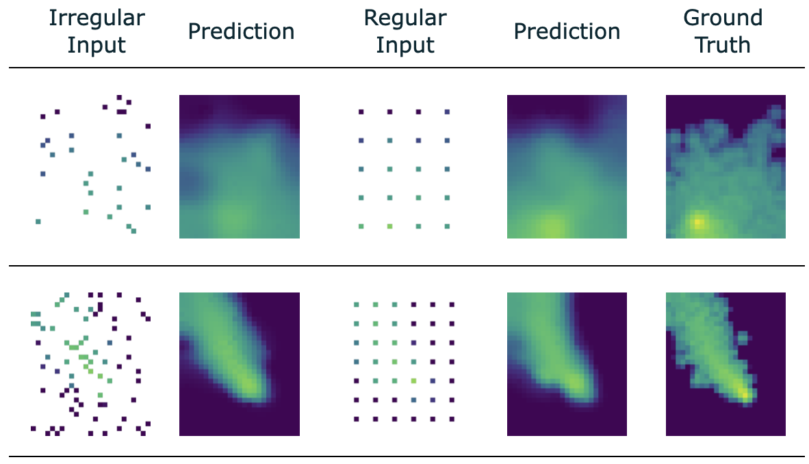

# RABI-GNN

## Introduction
This repository contains the code of *Radius-Based, Bi-Directional Graph Neural Networks (RABI-GNN)* for Gas Distribution Mapping. Gas Distribution Mapping describes the process of mapping the spatial and temporal distributions of gases in a given area. This repository is work in progress.



## Gas Distribution Dataset
The synthetic gas distribution dataset is based on the dataset that was previously made available in the repository of [Super-Resolution for Gas Distribution Mapping](https://github.com/BAMresearch/SRGDM/). In this repo, training and validation datasets are available through Git LFS (see `data/30x25.zip`). Unzip the files to this directory: `data/30x25/raw`.

## Citation
If you find this code useful, please cite our paper:
```
@inproceedings{winkler2024rabignn,
  title={Radius-Based, Bi-Directional Graph Neural Networks for Gas Distribution Mapping (RABI-GNN)},
  author={Winkler, Nicolas P and Neumann, Patrick P and Schaffernicht, Erik and Lilienthal, Achim J},
  booktitle={2024 IEEE International Symposium on Olfaction and Electronic Nose (ISOEN)},
  pages={1--3},
  year={2024},
  organization={IEEE}
}
```
